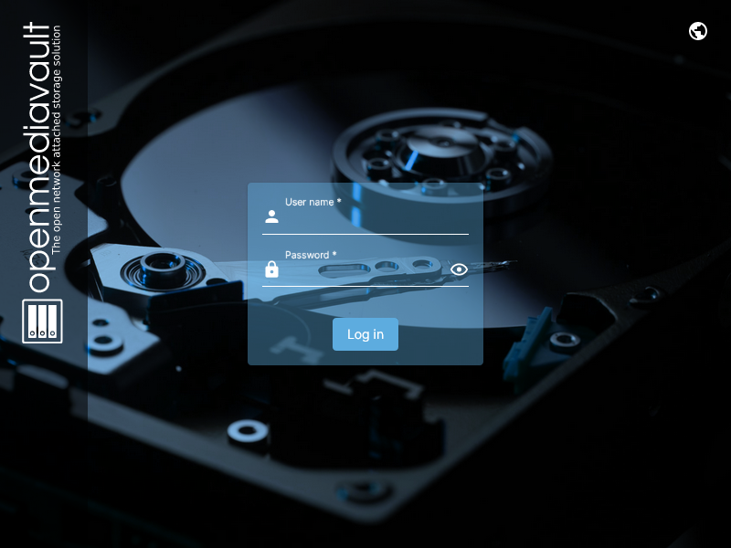
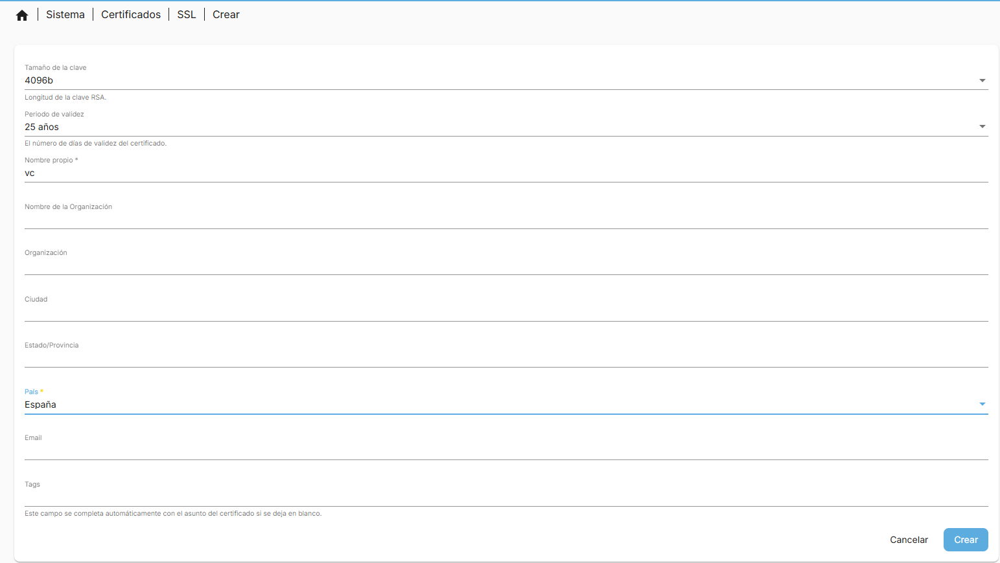
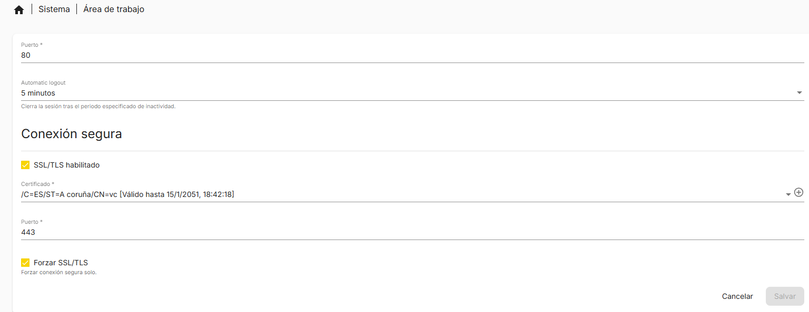
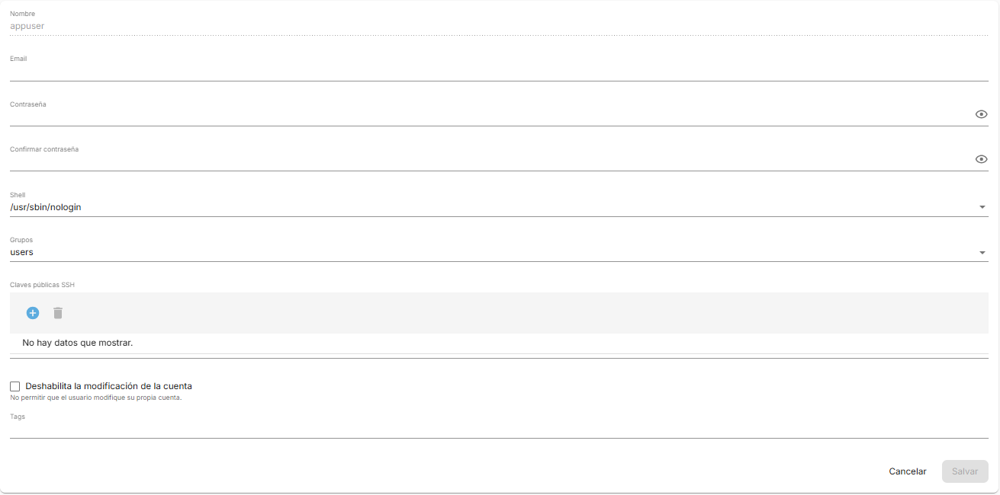
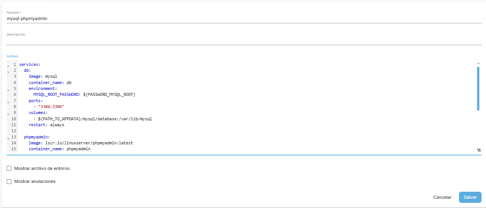
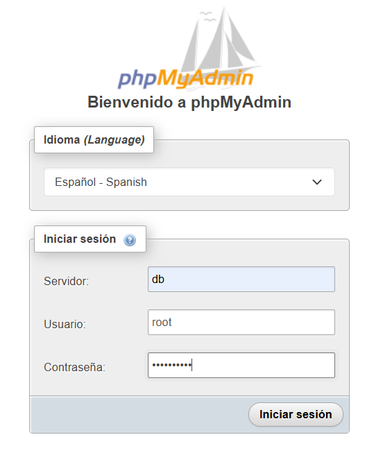
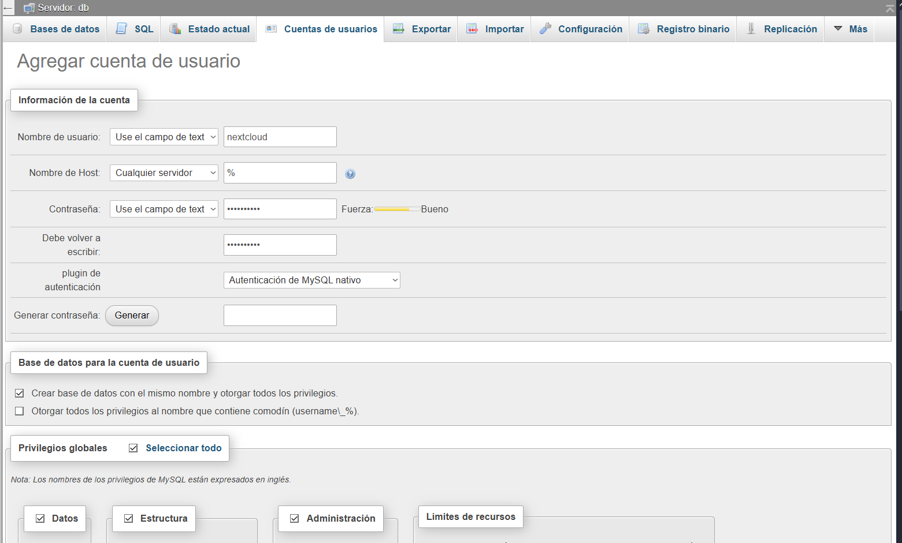
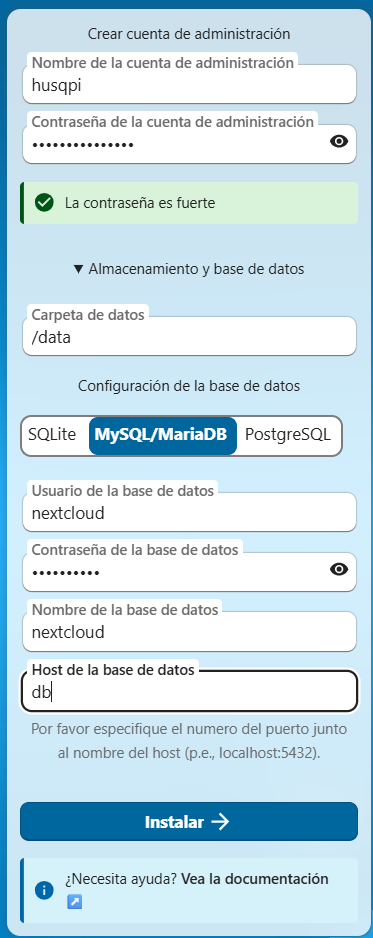

# Proxecto de Fin de Curso Anxo Vigo Canosa: Servidor NAS con Rasberry Pi 5


## 1. Introdución

Este proxecto ten como obxectivo a creación dun servidor NAS completamente funcional empregando unha Rasberry Pi 5. A idea nace da necesidade de dispor dun sistema de almacenamento en rede accesible, eficiente e económico. Este traballo combina hardware e software é permite comprender de maneira práctica o funcionamento dun servidor real nun entorno doméstico.


## 2. Xustificación do proxecto

A motivacion principal para facer este proxecto, e que xa desde fai un tempo queria facer o meu propio servidor. Enton foi cando dixen, pois este vai ser o meu proxecto, ademais de evitar pagar un servicio de almacenamiento na nube como Google Drive e Almacenar os meus datos nun sitio mais seguros, no meu propio servidor privado.


## 3. Obxectivos

Os obexectivos de este projecto son: 

* Crear un servidor NAS funcional empregando unha Rasberry Pi 5.
* Configurar un sistema de almacenamento en rede seguro e accesible Utilizando NextCloud.
* Instalar unha VPN, para poder acceder ao Nas desde calquera lugar.
* Aprender conceptos de administración de sistemas, redes e hardware.
* Poñer en práctica coñecementos adquiridos durante o ciclo formativo.

## 4. Hardware empregado

A continuacion vou detallar o hardware que utilizei para o meu proxecto.

### 4.1 Rasberry Pi 5 

Esta Rasberry Pi 5 8GB é o núcleo do proxecto. As súas características principais inclúen:

* Procesador ARM Cortex-A76
* Portas USB 3.0 de alta velocidade
* Melloras significativas respecto a xeracións anteriores
* Compatibilidade con almacenamento externo M.2 mediante adaptador

### 4.2  SanDisk Ultra 

Tarxeta microsd de 128GB con una velocidad de 150 MB/s

Aqui e onde vou a instalar o sistema operativo para a Rasberry Pi 5

### 4.3 Discos de almacenamento Utilizados 

Para o meu Proxecto mentres non consigo discos de gran capacidade vou a reutilizar discos que teño na casa.

O almacenamento que estou usando:

* HDD 2.5" de 500GB a 7200rpm da marca HGST 
* HDD 2.5" de 500GB a 5400rpm da marca Samsung
* HDD 2.5" de 320GB a 5400rpm da marca WDigital
* SSD 2.5" de 240GB da marca Kingston
  
Con esto vou a armar un **RAID 5**. O que me permite a tolenrancia de fallos nun so disco, e un espacio util total de **670.33GiB**. 


### 4.4 Radxa Penta Sata Hat Para Rasberry Pi 5 

Esto e unha tarjeta de expansion para conectarse coa rasberry para poder conectar discos, soporta ata 5 discos tanto HDD/SSD de 2.5" e discos HDD de 3.5".

* [Radxa Penta-Sata-Hat](https://radxa.com/products/accessories/penta-sata-hat)
* [Fonte de alimentación 12V 3A 5525](https://radxa.com/products/accessories/power-dc12-36w)


## 5. Instalación do sistema operativo

Optei por instalar **OpenMediaVault** na MicroSD.
Pasos principais:

1. Descargar Rasberry Pi Imager.
2. Seleccionar Rasberry Pi OS lite.
3. Configurar usuario.
4. Configurar a wifi si fora necesario.
5. Acivar o SSH.
6. Gravar o sistema na tarxeta SD.
7. Arrancar a Rasberry Pi desde a SD.

## 6. Configuración do NAS

Unha vez instalado o sistema operativo na Sd con `rasberry pi imager`, insertaremos a SD na rasberry e acenderémola, e pasado uns minutos, imos proceder a conectarnos a ela, mediante ssh co seginte comando desde a nosa terminal.
```
ssh usuario@enderezo IP / nombre do dispositivo
```
Para averiguar a enderezo IP, poderemos acceder ao noso router e nos mostrara a enderezo IP do noso dispositivo.

No seguinte paso imos actualizar o sistema co seguinte comando `sudo apt update && sudo apt upgrade -y` , asi teremos o sistema actualizado, e procederemos a instalar `OpenMediaVault` co seguinte comando, que e uns script de instalacion.
```
wget -O - https://raw.githubusercontent.com/OpenMediaVault-Plugin-Developers/installScript/master/install | sudo bash
```
Este proceso vai tardar uns minutos, cando termine teremos que meter a IP da nosa RasberryPI no navegador web, e tera que mostrar unha pagina asi:



O usuario predefinido e **admin** e a contrasinal **openmediavault**, que procederemos a cambiar tan pronto entremos a paxina inicial, clicando no engrenaxe arriba a dereita

## 6.1 Configuración de rede

Realizouse unha configuración básica para garantir estabilidade no acceso:

* Asignación de IP fixa para o NAS
* Activación de SSH para administración remota
* Comprobación de conectividade na rede local
* Imos crear un certificado SSl
* Habilitar o HTTPS

### 6.1.1 Certificado SSL e HTTPS
Para mellorar a seguridade e que o navegador non se queixe tanto, imos crear un certificado SSL propio e activar o modo seguro.

Para crealo imos a Sistema - Certificados - SSL, seleccionamos o botón de Máis (+) e dámoslle a Crear.

Na ventá que se abre, o máis importante é o **Nombre Propio**, onde poñeremos a IP do servidor ou o noso dominio, e ten que quedar asi:



Clicaremos en Salvar.

Agora para activalo, imos a Sistema - Área de trabajo, buscamos o apartado de **Conexión Segura**.

Temos que activar o interruptor de SSL/TLS e en **Certificado** seleccionamos o que acabamos de crear no paso anterior.

Ten que quedar asi:



Clicaremos en Salvar e arriba aparecerá a barra amarela de configuración, Confirmaremos os cambios.

Ao finalizar, o navegador recargarase e perderemos a conexión. Agora teremos que entrar poñendo https:// diante da IP:
```
https://192.168.1.128
```
### 6.2 Como Crear un Raid 

Para instalar o Plugin para permitir facer Raids, debemos ir a barra lateral buscar **Sistema** e entrar no apartado **Plugins**, xa dentro debemos buscar **Raid** clicar e instalar clicando no icono de Descarga, xusto na parte superior.

Debemos acutalizar a paxina premendo F5 e ir a **Almacenamiento**, debemos ir a discos e localirzar os que vas a usar, e debemos premer no icono da goma de borrar para limpar os discos que formaran parte do Raid.

Con esto xa feito imos ir a Raid, e clicar en crear, no meu caso vou crear un **Raid 5** e logo seleccionaremos os discos que imos a utilizar, e comfirmaremos os cambios en OpenMediaVault, este proceso tardara un rato.

Ahora imos Formatear e montar o disco, e imos clicar en Sistema de arquivos, clicar en crear e selecionaremos o tipo de sistema de ficheiro que queremos, eu utilizare **EXT4** e logo selccionaremos o disco e clicaremos en salvar, e xa pasara a opcion de montar, onde seleccionaremos o sistema e o umbral de uso e xa estaria todo listo para clicar en salvar e ter o noso Raid en funcionamento 


## 7. Servizos instalados

* Docker
* NextCloud
* TailScale

### 7.1 Docker

Instalar docker permite empaquetar aplicacións en en unidades chamadas contedores, esto e necesario para instalar o servicio de nextcloud entre outros.
Para instalalo necesitaremos, ir a barra lateral buscar o apartado **Plugins** e xa dentro de ese apartado buscar **OMV-Extras** e **Compose**
Con paquete OMV-Extras xa instalado necesitaremos confirmar o cambio e recargar a paxina, e ir a  **Sistema** localizado na barra lateral e clicar en omv-extras, activar Docker repo e clicar en Salvar.

A continuacion imos crear as seguintes carpetas no apartado de **almacenamiento** - **Carpetas Compartidas**:

* appdata
* data
* docker
* backup_compose

Xa feito esto imos ir a **Servicios** - **Compose** - **Configuracion** e teremos que meter o seguinte:


Con esto listo damoslle a salvar e daremoslle a reinstalar docker.

Por ultimo crearemos o usuario **appdata** cos seguientes permisos.



E daremoslle acceso de **lectura/escritura** en **appdata** e de **lectura** en data, ademais de en Control de Acceso so permitirlle a lectura.

#### 7.1.1 Variables de entorno

Imos crear unha variables de entorno que nos facilitaran o traballo ao instalar contedores con compose, para esto temos que escribir en **compose** dentro de **arquivos** clicaremos no icono cunha estreliña, e escribiremos o seguinte.

```
APPUSER_PUID=1002
APPUSER_PGID=100

TIME_ZONE_VALUE=Europe/Madrid

PATH_TO_APPDATA=/srv/dev-disk-by-uuid-dee6e7ad-abb0-483d-93f4-3052adb442d4/appdata/
PATH_TO_DATA=/srv/dev-disk-by-uuid-dee6e7ad-abb0-483d-93f4-3052adb442d4/data/

PASSWORD_MYSQL_ROOT=mipasword

PASSWORD_PIHOLE_ROOT=mipasword


```


### 7.2 NextCloud 

Para instalar NextCloud, necesitaremos unha base de datos, por eso instalaremos **Mysql** e **PHPMyAdmin**.

Para instalalos imos a utilizar o seguinte codigo:

```
services:
  db:
    image: lscr.io/linuxserver/mariadb:latest
    container_name: db
    environment:
      - PUID=${APPUSER_PUID}
      - PGID=${APPUSER_PGID}
      - TZ=${TIME_ZONE_VALUE}
      - MYSQL_ROOT_PASSWORD=${PASSWORD_MYSQL_ROOT}
    volumes:
      - ${PATH_TO_APPDATA}/mysql/database:/config
    ports:
      - "3306:3306"
    restart: always

  phpmyadmin:
    image: lscr.io/linuxserver/phpmyadmin:latest
    container_name: phpmyadmin
    environment:
      - PUID=${APPUSER_PUID}
      - PGID=${APPUSER_PGID}
      - TZ=${TIME_ZONE_VALUE}
      - PMA_ARBITRARY=1
      - PMA_HOST=db
    volumes:
      - ${PATH_TO_APPDATA}/phpmyadmin/config:/config
    ports:
      - 8081:80
    restart: unless-stopped
    depends_on:
      - db 

```

Con esto copiado vamos a Servicios - Compose - Arquivos, seleccionamos Mas e añadir, e ten que quedar asi.


Clicaremos en  salvar e Volveremos a o apartado de variables de entorno para añadir: `PASSWORD_MYSQL_ROOT=(contrasinal)`, salvaremos o arquivo e comfirmaremos os cambios, por ultimo clicaremos sobre o arquivo e daremoslle a up o icono ca flecha para arriba.

Ao finalizar en Comouse podemos ir a servicios e comprobar que estan funcionando.

Para acceder a phpmyadmimin teremos que colocar o siguiente no navegador `http://192.168.1.128:8081` e colocaremos o usuario e contrasinal


Dentro de PhpMyAdmin vamos crear un usuario ca seguinte configuracion:



E clicamos en continuar, quedando asi:

* Nonbre-Base de datos = nextcloud
* Nonbre-User = nextcloud

Para finalizar imos instalar Nextcloud, clicando en Compose-Arquivos-Crear-Crear desde los exemplo.

E seleccionaremos Nextcloud,clicaremos no cuadrado de mais, meteremos unha descripcion e daremoslle a engadir,confirmaremos os cambios, e editaremos o arquivo, e ten que quedar asi:

```
  nextcloud:
    image: lscr.io/linuxserver/nextcloud:latest
    container_name: nextcloud
    environment:
      - PUID=${APPUSER_PUID}
      - PGID=${APPUSER_PGID}
      - TZ=${TIME_ZONE_VALUE}
    volumes:
      - ${PATH_TO_APPDATA}/nextcloud/config:/config
      - ${PATH_TO_DATA}:/data
    ports:
      - 4443:443
    restart: unless-stopped
    depends_on:
      - db
      - phpmyadmin
```
O copiaremos e o meteremos co contenedor de Mysql.

Xa feito esto, no navegador poñeremos `https://ip`, e meteremos as seguintes configuracions:



### 7.3 Tailscale

##### [Aqui vos deixo unha VPN e un DNS diferente.](C:\Users\vigoa\Documents\NextCloud\Proxecto_SMR\Varios\Instalar_Pi-Hole_Wireguard.pdf)

Para poder acceder ao noso servidor desde fóra da casa de forma segura sen abrir portos, necesitaremos unha VPN, por eso instalaremos Tailscale.

Se non queremos usar Docker, podemos instalar Tailscale directamente no servidor. Esto é útil para ter sempre acceso ao sistema, incluso se Docker falla.

Para instalalo, primeiro teremos que abrir a terminal ou conectarnos por SSH ao servidor.

Imos a utilizar o seguinte comando para descargar e instalar o script oficial:

```
curl -fsSL https://tailscale.com/install.sh | sh
```
Unha vez remate a instalación (tarda uns segundos), teremos que inicialo. Para iso executamos:
```
sudo tailscale up
```
Ao darlle a enter, a terminal devolveranos unha dirección web (un link) parecida a esta:
```
To authenticate, visit:
https://login.tailscale.com/a/1234567890
```
Copiaremos ese link e pegarémolo no noso navegador do PC ou móbil. Aí teremos que loguearnos coa nosa conta (Google, Microsoft, etc.) para autorizar o dispositivo.

Unha vez feito, na terminal aparecerá "Success".

Agora podemos ir á web de Tailscale (Admin Console) e veremos o noso servidor conectado e coa IP asignada.


## 8. Seguridade

A seguridade reforzouse mediante:

* Permisos axeitados en carpetas
* Limitación do acceso remoto: deshabilitaremos o ssh 
* Creouse un certificado SSL propio e activouse o HTTPS
* Actualizacións periódicas do sistema

## 9. Probas de funcionamento

Realizáronse diversas probas:

* Acceso ás carpetas compartidas dende outro dispositivo
* Funcionamento correcto do servidor DNS
* Monitorización do rendemento da Rasberry Pi

## 10. Problemas encontrados e solucións

Durante o desenvolvemento apareceron algunhas dificultades:

## 10.1 A tarxeta de expansion non detectaba os discos
 Solucionado: modificar arquivo, co comando `sudo nano /boot/fimware/config.txt` e engadimos na ultima linea do arquivo:
```
[all] 
dtparam=pciex1=on 
dtparam=pciex1_gen=3
``` 

## 10.2 Solución Erro: Dominio non confiable en NextCloud
Se ao intentar entrar en Nextcloud dende unha IP de Tailscale aparece unha pantalla azul coa mensaxe "Acceso a través de un dominio en el que no se confía", é porque Nextcloud ten unha lista de seguridade e bloquea todo o que non estea nela.

Para autorizar a nova IP, temos que editar o arquivo config.php. Como é un arquivo protexido, non podemos facelo cun usuario normal, así que seguiremos estes pasos na terminal.

Primeiro, temos que converternos en usuario Root.

 Para iso executamos:

```
sudo -i
```

Unha vez sexamos root, navegaremos ata a ruta onde está a configuración.

```
cd /srv/dev-disk-by-uuid-dee6e7ad-abb0-483d-93f4-3052adb442d4/appdata/nextcloud/config/www/nextcloud/config
```
Agora abriremos o arquivo co editor de texto nano:

```

nano config.php
```
Dentro do arquivo, temos que buscar o bloque que pon **trusted_domains**. Temos que engadir unha liña nova coa nosa IP seguindo a orde dos números.

Ten que quedar asi:

```PHP
  'trusted_domains' => 
  array (
    0 => 'localhost',
    1 => 'naspi',
    2 => '100.114.185.22',
    3 => '192.168.1.128',
  ),
```

Para rematar:

* Pulsamos Ctrl + O e logo Enter para gardar.
* Pulsamos Ctrl + X para saír do editor.
* Escribimos exit para pechar a sesión de root.

Agora, se recargamos a páxina web, o acceso estará permitido e xa veremos o login de Nextcloud.


## 11. Fabricación da Carcasa con Impresión 3D

Dado que o sistema consta de múltiples compoñentes (Raspberry Pi, HAT, 4 discos duros e cableado), era imprescindible contar cunha estrutura física que mantivese todo unido, protexido e ordenado. Para isto, optouse pola tecnoloxía de impresión 3D.

### 11.1 Xustificación do deseño
A carcasa cumpre tres funcións vitais neste proxecto:
1.  **Refrixeración activa:** O deseño canaliza o fluxo de aire dende o ventilador superior a través dos discos duros e a Raspberry Pi, evitando o sobrequecemento.
2.  **Protección mecánica:** Evita que os discos duros vibren ou se movan, o cal podería causar erros de lectura ou danos físicos nos sectores do disco.
3.  **Xestión de cableado:** Oculta os cables SATA e de alimentación, dándolle un acabado profesional ao servidor.

### 11.2 Equipamento e Parámetros
Para a fabricación das pezas utilizouse unha impresora 3D **Artillery Genius**. Escolleuse o material **ASA** pola súa alta resistencia aos raios UV e, sobre todo, pola súa resistencia térmica superior, ideal para compoñentes que poden alcanzar temperaturas medias-altas.

A continuación móstrase un resumo dos parámetros de laminado utilizados:

| Parámetro                | Valor                                                                      |
| :----------------------- | :------------------------------------------------------------------------- |
| **Material**             | [ASA](https://drive.google.com/file/d/1JwExN4wd10Q1Cfse2LEXTuhXmUYmsdq4/view?usp=sharing) |
| **Altura de capa**       | 0.12 mm                                                                    |
| **Recheo (Infill)**      | 20%                                                                        |
| **Paredes**              | 3 liñas                                                                    |
| **Temperatura Boquilla** | 240°C - 245°C                                                              |
| **Temperatura Cama**     | 95°C - 100°C                                                               |
| **Refrixeración**        | 0%                                                                         |

Podes consultar o documento detallado con toda a configuración de Cura no seguinte enlace:

**[Perfil de Impresión Completo (ASA)](https://drive.google.com/drive/folders/1RkX4N4Xy4HfnvDoIQE6B7NaK1xkpEFSf?usp=sharing)**

### 11.3 Montaxe final
Unha vez impresas as pezas, realizouse a montaxe utilizando parafusos métrica M2.5 e M3. Engadiuse un ventilador PWM Noctua na parte superior controlado polo software do Radxa Penta HAT, que se activa automaticamente segundo a temperatura da CPU.

### 11.4 Créditos e Licenza do Deseño
Para a realización da carcasa optouse por utilizar o deseño creado por Michael Klements, adaptándoo ás necesidades específicas deste proxecto. Recoñécese a autoría orixinal e agradécese a documentación técnica proporcionada.

* **Autor:** Michael Klements (The DIY Life)
* **Proxecto Orixinal:** "I Built A 4-Bay Raspberry Pi 5 Based NAS"
* **Fonte do modelo:** [https://the-diy-life.com/i-built-a-4-bay-raspberry-pi-5-based-nas/](https://the-diy-life.com/i-built-a-4-bay-raspberry-pi-5-based-nas/)

### 11.5 Arquivos de Impresión
Os arquivos laminados listos para imprimir pódense atopar na seguinte localización do proxecto:

**[Enlace á carpeta GCodes](https://drive.google.com/drive/folders/181ueH3BIyR8PGevTSBU_5yRnzfdhhJOC?usp=sharing)**

## 12. Conclusión

Este proxecto permitiu crear un servidor NAS funcional, seguro e totalmente personalizado utilizando unha Rasberry Pi 5. Ademais de ofrecer unha solución práctica para almacenar datos persoais, o proceso serviu para adquirir coñecementos en administración de sistemas, servizos de rede, e configuración de hardware.

E aprendin cousas que non se dan no ciclo, porque non nos aprenden a crear unha vpn propia ou un servidor de almacenamiento que pode ser mui util. 


## 13. Anexos

Neste apartado recóllese toda a documentación complementaria, recursos gráficos e referencias necesarias para replicar o proxecto.

* Imaxes da montaxe
* Capturas de comandos
* Links de compra
* Software de instalacion
### 13.1 Material Fotográfico
Recompilación visual do proceso de montaxe e do resultado final do servidor.
*  **[Ver Galería de Imaxes da Montaxe](https://drive.google.com/drive/folders/197o6vWHkWA7Vpss-BtKSE1F9kdA77Qjc?usp=sharing)**
    * *Inclúe: Fotos dos compoñentes, ensamblaxe do HAT, conexión dos discos e instalación na carcasa.*

### 13.2 Rexistro de Configuración
Capturas de pantalla que documentan os pasos críticos da configuración do software.
*  **[Capturas de Comandos](https://github.com/AnxoVC/Proxecto_SMR_AnxoVC/tree/main/Imagenes)**

### 13.3 Listaxe de Compras e Hardware
*  **[ Anexo de Compras Completo](https://github.com/AnxoVC/Proxecto_SMR_AnxoVC/blob/main/Varios/LinksDeCompra.pdf)**
    * *Inclúe: Raspberry Pi 5, Radxa Penta HAT e Ventilador Noctua.*

### 13.4 Manuais Técnicos e Scripts
Documentación técnica específica elaborada durante o proxecto para configuracións avanzadas.
1.  **Seguridade e Rede:**
    * **[Manual de Instalación: Pi-hole + WireGuard](https://github.com/AnxoVC/Proxecto_SMR_AnxoVC/blob/main/Varios/Instalar_Pi-Hole_Wireguard.pdf)**
2.  **Fabricación (Impresión 3D):**
    * **[Perfil de Impresión ASA (Artillery Genius)](https://drive.google.com/file/d/1axdeiDCbMl3HMvVPL1501YVSku34JNCY/view?usp=drive_link)**
    * **[Arquivos de Impresión (.gcode)](https://drive.google.com/drive/folders/181ueH3BIyR8PGevTSBU_5yRnzfdhhJOC?usp=drive_link)**

### 13.5 Software de Instalación e Utilidades
Relación de [software](https://github.com/AnxoVC/Proxecto_SMR_AnxoVC/tree/main/Software) de terceiros empregado para a posta en marcha e xestión do servidor:

| Software                | Función                           | Ligazón Oficial                                            |
| :---------------------- | :-------------------------------- | :--------------------------------------------------------- |
| **Raspberry Pi Imager** | Gravación do SO na MicroSD        | [Descargar](https://www.raspberrypi.com/software/)         |
| **Ultimaker Cura**      | Laminado (Slicing) dos modelos 3D | [Descargar](https://ultimaker.com/software/ultimaker-cura) |
| **PuTTY / OpenSSH**     | Conexión remota por terminal      | [Descargar](https://www.putty.org/)                        |
| **Advanced IP Scanner** | Localización da IP na rede local  | [Descargar](https://www.advanced-ip-scanner.com/)          |
| **Tailscale**           | Rede Mesh e VPN (Alternativa)     | [Descargar](https://tailscale.com/download)                |


