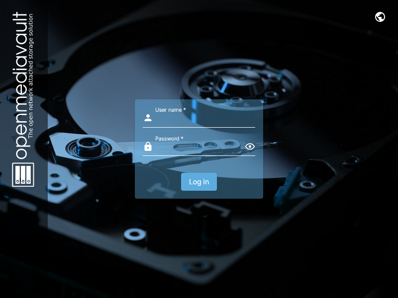
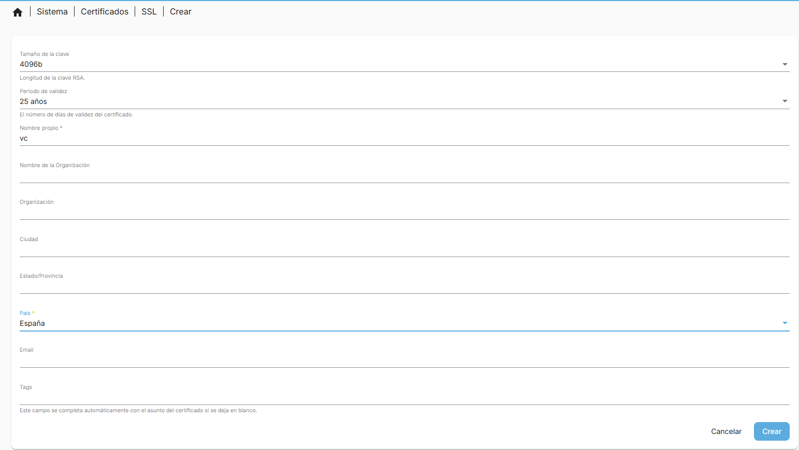
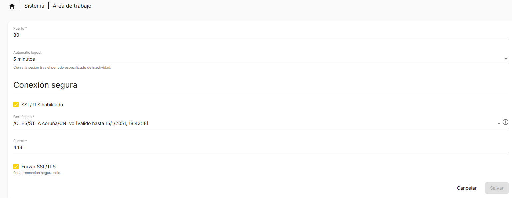
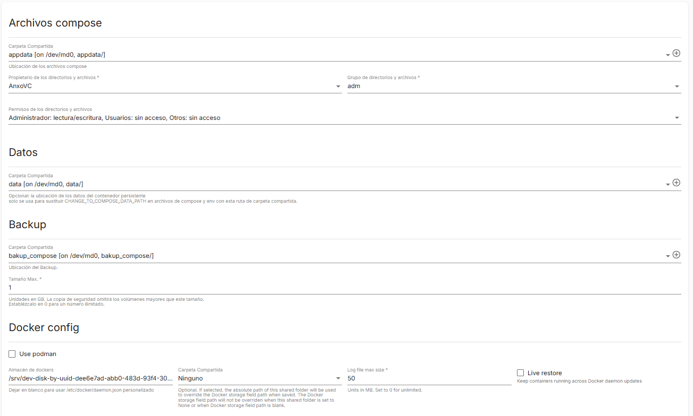
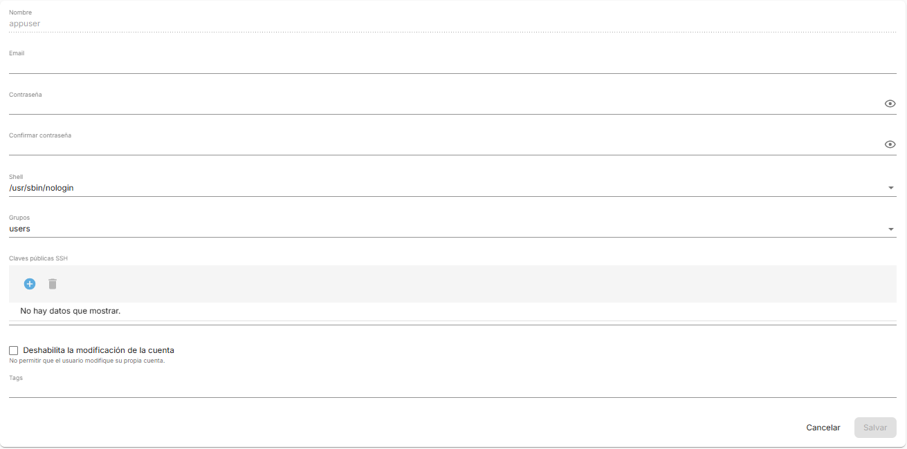
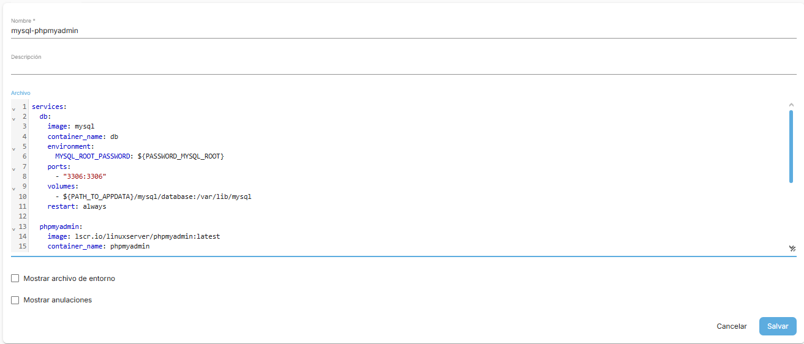
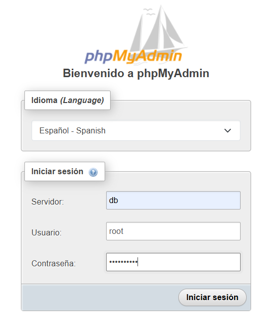
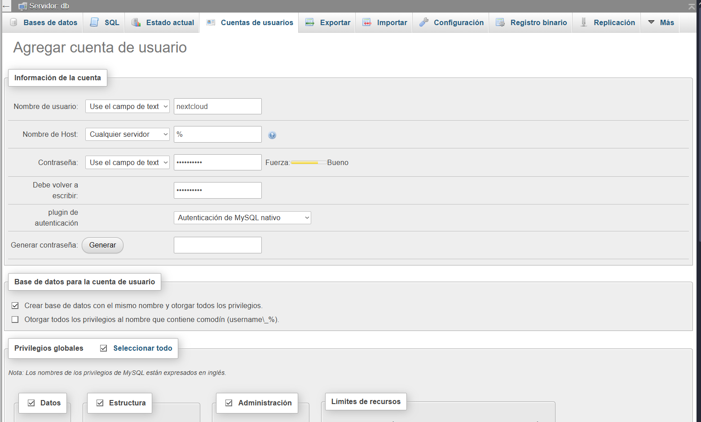
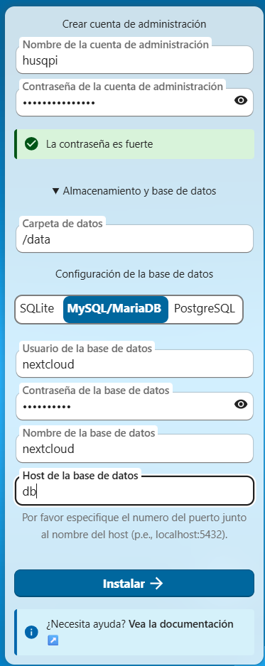

# Projeto de Fim de Curso Anxo Vigo Canosa: Servidor NAS com Rasberry Pi 5


## 1. Introdução

Este projeto tem como objetivo a criação de um servidor NAS completamente funcional utilizando um Rasberry Pi 5. A ideia nasce da necessidade de dispor de um sistema de armazenamento em rede acessível, eficiente e económico. Este trabalho combina hardware e software e permite compreender de maneira prática o funcionamento de um servidor real num ambiente doméstico.


## 2. Justificação do projeto

A motivação principal para fazer este projeto, é que já há algum tempo queria fazer o meu próprio servidor. Então foi quando disse, pois este vai ser o meu projeto, além de evitar pagar um serviço de armazenamento na nuvem como o Google Drive e armazenar os meus dados num sítio mais seguro, no meu próprio servidor privado.


## 3. Objetivos

Os objetivos deste projeto são: 

* Criar um servidor NAS funcional utilizando um Rasberry Pi 5.
* Configurar um sistema de armazenamento em rede seguro e acessível utilizando NextCloud.
* Instalar uma VPN, para poder aceder ao NAS a partir de qualquer lugar.
* Aprender conceitos de administração de sistemas, redes e hardware.
* Pôr em prática conhecimentos adquiridos durante o ciclo formativo.

## 4. Hardware utilizado

A seguir vou detalhar o hardware que utilizei para o meu projeto.

### 4.1 Rasberry Pi 5 

Este Rasberry Pi 5 8GB é o núcleo do projeto. As suas características principais incluem:

* Processador ARM Cortex-A76
* Portas USB 3.0 de alta velocidade
* Melhorias significativas em relação a gerações anteriores
* Compatibilidade com armazenamento externo M.2 mediante adaptador

### 4.2  SanDisk Ultra 

Cartão microsd de 128GB com uma velocidade de 150 MB/s

Aqui é onde vou instalar o sistema operativo para o Rasberry Pi 5

### 4.3 Discos de armazenamento Utilizados 

Para o meu Projeto enquanto não consigo discos de grande capacidade vou reutilizar discos que tenho em casa.

O armazenamento que estou a usar:

* HDD 2.5" de 500GB a 7200rpm da marca HGST 
* HDD 2.5" de 500GB a 5400rpm da marca Samsung
* HDD 2.5" de 500GB a 5400rpm da marca WDigital
* HDD 2.5" de 500GB a 5400rpm da marca APPLE
  
Com isto vou armar um **RAID 5**. O que me permite a tolerância a falhas num só disco, e um espaço útil total de **1.3TB**. 


### 4.4 Radxa Penta Sata Hat Para Rasberry Pi 5 

Isto é uma placa de expansão para conectar-se com o raspberry para poder conectar discos, suporta até 5 discos tanto HDD/SSD de 2.5" como discos HDD de 3.5".

* [Radxa Penta-Sata-Hat](https://radxa.com/products/accessories/penta-sata-hat)
* [Fonte de alimentação 12V 3A 5525](https://radxa.com/products/accessories/power-dc12-36w)


## 5. Instalação do sistema operativo

Optei por instalar o **OpenMediaVault** na MicroSD.
Passos principais:

1. Descarregar o Rasberry Pi Imager.
2. Selecionar Rasberry Pi OS lite.
3. Configurar utilizador.
4. Configurar o wifi se for necessário.
5. Ativar o SSH.
6. Gravar o sistema no cartão SD.
7. Arrancar o Rasberry Pi a partir do SD.

## 6. Configuração do NAS

Uma vez instalado o sistema operativo na SD com o `rasberry pi imager`, inseriremos a SD no raspberry e ligá-lo-emos, e passados uns minutos, iremos proceder a conectar-nos a ele, mediante ssh com o seguinte comando a partir do nosso terminal.
```bash
ssh utilizador@endereço IP / nome do dispositivo
```
Para descobrir o endereço IP, poderemos aceder ao nosso router e mostrar-nos-á o endereço IP do nosso dispositivo.

No seguinte passo iremos atualizar o sistema com o seguinte comando `sudo apt update && sudo apt upgrade -y` , assim teremos o sistema atualizado, e procederemos a instalar o `OpenMediaVault` com o seguinte comando, que é um script de instalação.
```bash
wget -O - https://raw.githubusercontent.com/OpenMediaVault-Plugin-Developers/installScript/master/install | sudo bash
```
Este processo vai demorar uns minutos, quando terminar teremos que colocar o IP do nosso RasberryPI no navegador web, e terá de mostrar uma página assim:



O utilizador predefinido é **admin** e a palavra-passe **openmediavault**, que procederemos a alterar logo que entrarmos na página inicial, clicando na engrenagem no canto superior direito.

## 6.1 Configuração da rede

Realizou-se uma configuração básica para garantir estabilidade no acesso:

* Atribuição de IP fixo para o NAS
* Ativação de SSH para administração remota
* Verificação da conectividade na rede local
* Iremos criar um certificado SSL
* Habilitar o HTTPS

### 6.1.1 Certificado SSL e HTTPS
Para melhorar a segurança e para que o navegador não se queixe tanto, iremos criar um certificado SSL próprio e ativar o modo seguro.

Para criá-lo iremos a Sistema - Certificados - SSL, selecionamos o botão Mais (+) e clicamos em Criar.

Na janela que se abre, o mais importante é o **Nome Próprio**, onde colocaremos o IP do servidor ou o nosso domínio, e tem que ficar assim:



Clicaremos em Salvar.

Agora para ativá-lo, iremos a Sistema - Área de trabalho, procuramos a secção de **Conexão Segura**.

Temos que ativar o interruptor de SSL/TLS e em **Certificado** selecionamos o que acabámos de criar no passo anterior.

Tem que ficar assim:



Clicaremos em Salvar e acima aparecerá a barra amarela de configuração. Confirmaremos as alterações.

Ao finalizar, o navegador recarregará e perderemos a conexão. Agora teremos que entrar colocando https:// antes do IP:
```
https://naspi
```
### 6.2 Como Criar um Raid 

Para instalar o Plugin para permitir fazer Raids, devemos ir à barra lateral procurar **Sistema** e entrar na secção **Plugins**, já lá dentro devemos procurar **Raid** clicar e instalar clicando no ícone de Download, mesmo na parte superior.

Devemos atualizar a página pressionando F5 e ir a **Armazenamento**, devemos ir a discos e localizar os que vais usar, e devemos pressionar no ícone da borracha para limpar os discos que formarão parte do Raid.

Com isto já feito iremos a Raid, e clicar em criar, no meu caso vou criar um **Raid 5** e depois selecionaremos os discos que iremos utilizar, e confirmaremos as alterações no OpenMediaVault, este processo demorará um pouco.

Agora iremos Formatar e montar o disco, e iremos clicar em Sistema de ficheiros, clicar em criar e selecionaremos o tipo de sistema de ficheiros que queremos, eu utilizarei **EXT4** e depois selecionaremos o disco e clicaremos em salvar, e passará à opção de montar, onde selecionaremos o sistema e o limiar de uso e já estaria tudo pronto para clicar em salvar e ter o nosso Raid em funcionamento 


## 7. Serviços instalados

* Docker
* NextCloud
* TailScale

### 7.1 Docker

Instalar o docker permite empacotar aplicações em unidades chamadas contêineres, isto é necessário para instalar o serviço de nextcloud entre outros.
Para instalá-lo necessitaremos ir à barra lateral procurar a secção **Plugins** e já dentro dessa secção procurar **OMV-Extras** e **Compose**.
Com o pacote OMV-Extras já instalado necessitaremos confirmar a alteração e recarregar a página, e ir a **Sistema** localizado na barra lateral e clicar em omv-extras, ativar o repositório Docker e clicar em Salvar.

A seguir iremos criar as seguintes pastas na secção de **armazenamento** - **Pastas Partilhadas**:

* appdata
* data
* docker
* backup_compose

Já feito isto iremos a **Serviços** - **Compose** - **Configuração** e teremos que colocar o seguinte:



Com isto pronto damos em salvar e daremos a reinstalar o docker.

Por último criaremos o utilizador **appdata** com as seguintes permissões.



E dar-lhe-emos acesso de **leitura/escrita** em **appdata** e de **leitura** em data, além de em Controlo de Acesso lhe permitir apenas a leitura.

#### 7.1.1 Variáveis de ambiente

Iremos criar umas variáveis de ambiente que nos facilitarão o trabalho ao instalar contêineres com compose, para isto temos que escrever em **compose** dentro de **arquivos** clicaremos no ícone com uma estrelinha, e escreveremos o seguinte.

```yaml
APPUSER_PUID=1002
APPUSER_PGID=100

TIME_ZONE_VALUE=Europe/Madrid

PATH_TO_APPDATA=/srv/dev-disk-by-uuid-dee6e7ad-abb0-483d-93f4-3052adb442d4/appdata/
PATH_TO_DATA=/srv/dev-disk-by-uuid-dee6e7ad-abb0-483d-93f4-3052adb442d4/data/

PASSWORD_MYSQL_ROOT=mipasword

PASSWORD_PIHOLE_ROOT=mipasword


```


### 7.2 NextCloud 

Para instalar o NextCloud, necessitaremos de uma base de dados, por isso instalaremos o **Mysql** e o **PHPMyAdmin**.

Para instalá-los vamos utilizar o seguinte código:

```yaml
services:
  db:
    image: lscr.io/linuxserver/mariadb:latest
    container_name: db
    environment:
      - PUID=${APPUSER_PUID}
      - PGID=${APPUSER_PGID}
      - TZ=${TIME_ZONE_VALUE}
      - MYSQL_ROOT_PASSWORD=${PASSWORD_MYSQL_ROOT}
    volumes:
      - ${PATH_TO_APPDATA}/mysql/database:/config
    ports:
      - "3306:3306"
    restart: always

  phpmyadmin:
    image: lscr.io/linuxserver/phpmyadmin:latest
    container_name: phpmyadmin
    environment:
      - PUID=${APPUSER_PUID}
      - PGID=${APPUSER_PGID}
      - TZ=${TIME_ZONE_VALUE}
      - PMA_ARBITRARY=1
      - PMA_HOST=db
    volumes:
      - ${PATH_TO_APPDATA}/phpmyadmin/config:/config
    ports:
      - 8081:80
    restart: unless-stopped
    depends_on:
      - db 

```

Com isto copiado vamos a Serviços - Compose - Arquivos, selecionamos Mais e adicionar, e tem que ficar assim.


Clicaremos em salvar e Voltaremos à secção de variáveis de ambiente para adicionar: `PASSWORD_MYSQL_ROOT=(palavra-passe)`, salvaremos o arquivo e confirmaremos as alterações, por último clicaremos sobre o arquivo e daremos a up no ícone com a seta para cima.

Ao finalizar no Compose podemos ir a serviços e verificar que estão a funcionar.

Para aceder ao phpmyadmimin teremos que colocar o seguinte no navegador `http://naspi:8081` e colocaremos o utilizador e palavra-passe


Dentro do PhpMyAdmin vamos criar um utilizador com a seguinte configuração:



E clicamos em continuar, ficando assim:

* Nome-Base de dados = nextcloud
* Nome-User = nextcloud

Para finalizar iremos instalar o Nextcloud, clicando em Compose-Arquivos-Criar-Criar a partir do exemplo.

E selecionaremos o Nextcloud, clicaremos no quadrado do mais, meteremos uma descrição e daremos para adicionar, confirmaremos as alterações, e editaremos o arquivo, e tem que ficar assim:

```yaml
  nextcloud:
    image: lscr.io/linuxserver/nextcloud:latest
    container_name: nextcloud
    environment:
      - PUID=${APPUSER_PUID}
      - PGID=${APPUSER_PGID}
      - TZ=${TIME_ZONE_VALUE}
    volumes:
      - ${PATH_TO_APPDATA}/nextcloud/config:/config
      - ${PATH_TO_DATA}:/data
    ports:
      - 4443:443
    restart: unless-stopped
    depends_on:
      - db
      - phpmyadmin
```
Copiaremos e o meteremos com o contêiner de Mysql.

Já feito isto, no navegador colocaremos `https://ip`, e colocaremos as seguintes configurações:



### 7.2.1 Configuração de Memories
Para melhorar a gestão de fotos e vídeos, instalou-se a aplicação Memories. Esta app oferece uma experiência muito mais rápida e fluida do que a galeria predefinida do nextcloud e semelhante ao Google Photos.

1. Instalação: Executamos os seguintes comandos para descarregar a app e gerar o índice de fotos existente:

```Bash
docker exec -it nextcloud occ app:install memories
docker exec -it nextcloud occ memories:index
```
2. Configuração de Vídeo, para poder reproduzir vídeos dentro do navegador, é necessário indicar ao Nextcloud onde se encontra o transcodificador FFmpeg:

```Bash
docker exec -it nextcloud occ config:system:set memories.vod.path -value="/usr/bin/ffmpeg"
```
3. Ativação de Miniaturas de Vídeo, o Nextcloud não gera capas para os vídeos para poupar recursos. Para ver as imagens dos vídeos na galeria, ativaram-se os geradores correspondentes com estes comandos:

```Bash
# Ativar o provedor geral de vídeo
docker exec -it nextcloud occ config:system:set enabledPreviewProviders 1 --value="OC\Preview\Movie"

# Ativar suporte para telemóveis
docker exec -it nextcloud occ config:system:set enabledPreviewProviders 2 --value="OC\Preview\MP4"

# Ativar suporte para outros formatos 
docker exec -it nextcloud occ config:system:set enabledPreviewProviders 3 --value="OC\Preview\MKV"
```
Finalmente, reiniciamos o contêiner para aplicar as alterações:

```Bash
docker restart nextcloud
```

### 7.3 Tailscale

##### [Aqui vos deixo uma VPN e um DNS diferente.](C:\Users\vigoa\Documents\NextCloud\Proxecto_SMR\Varios\Instalar_Pi-Hole_Wireguard.pdf)

Para poder aceder ao nosso servidor a partir de fora de casa de forma segura sem abrir portas, necessitaremos de uma VPN, por isso instalaremos o Tailscale.

Se não queremos usar Docker, podemos instalar o Tailscale diretamente no servidor. Isto é útil para ter sempre acesso ao sistema, mesmo se o Docker falhar.

Para instalá-lo, primeiro teremos que abrir o terminal ou conectarmo-nos por SSH ao servidor.

Iremos utilizar o seguinte comando para descarregar e instalar o script oficial:

```
curl -fsSL https://tailscale.com/install.sh | sh
```
Uma vez terminada a instalação (demora uns segundos), teremos que iniciá-lo. Para isso executamos:
```
sudo tailscale up
```
Ao dar enter, o terminal devolver-nos-á um endereço web (um link) parecido com este:
```
To authenticate, visit:
https://login.tailscale.com/a/1234567890
```
Copiaremos esse link e colá-lo-emos no nosso navegador do PC ou telemóvel. Aí teremos que fazer login com a nossa conta (Google, Microsoft, etc.) para autorizar o dispositivo.

Uma vez feito, no terminal aparecerá "Success".

Agora podemos ir à web do Tailscale (Admin Console) e veremos o nosso servidor conectado e com o IP atribuído.

### 7.4 Monitorização com Beszel
Para ter um controlo detalhado do estado do hardware (CPU, RAM, temperatura, uso de discos e Docker) sem consumir muitos recursos, escolhi o Beszel. É uma ferramenta de monitorização muito leve que consta de duas partes: o Hub (o painel de controlo) e o Agente (que recolhe os dados).

Para instalá-lo, adicionamos o seguinte bloco ao nosso arquivo docker-compose.yml junto com os outros serviços:

```YAML
services:
  beszel:
    image: henrygd/beszel:latest
    container_name: beszel
    restart: unless-stopped
    ports:
      - "8090:8090"
    volumes:
      - ${PATH_TO_APPDATA}/beszel/data:/beszel_data
```
#### Processo de configuração:

* Primeiro iniciamos apenas o contêiner beszel.

* Entramos no navegador em http://naspi:8090 e criamos o utilizador administrador.

* Dentro do painel, clicamos em "Add System". Isto dar-nos-á uma Chave Pública.

* Copiamos essa chave e colamo-la nas variáveis de ambiente ou diretamente no docker-compose.yml onde diz KEY=.

* Iniciamos o contêiner beszel-agent dentro do mesmo arquivo de compose do beszel.
```YAML
  beszel-agent:
    image: henrygd/beszel-agent:latest
    container_name: beszel-agent
    restart: unless-stopped
    network_mode: host
    volumes:
      - /var/run/docker.sock:/var/run/docker.sock:ro
      - /:/extra/root:ro
    environment:
      - PORT=45876
      - KEY=Cola aqui a tua chave pública 
```

## 8. Segurança

A segurança reforçou-se através de:

* Permissões adequadas em pastas
* Limitação do acesso remoto: desativaremos o ssh 
* Criou-se um certificado SSL próprio e ativou-se o HTTPS
* Atualizações periódicas do sistema
* Além de aceder de fora da rede sem abrir portas.
* Utilizamos palavras-passe seguras.


## 9. Testes de funcionamento

Realizaram-se diversos testes:

* Acesso às pastas partilhadas a partir de outro dispositivo

* Funcionamento correto do servidor DNS
  
* Monitorização do desempenho do Rasberry Pi
  

## 10. Problemas encontrados e soluções

Durante o desenvolvimento apareceram algumas dificuldades:

## 10.1 A placa de expansão Radxa não detetava os discos
 Para solucioná-lo devemos alterar o arquivo, com o comando `sudo nano /boot/firmware/config.txt` e adicionamos na última linha do arquivo:
```bash
[all] 
dtparam=pciex1=on 
dtparam=pciex1_gen=3
``` 

## 10.2 Domínio não confiável no NextCloud
Se ao tentar entrar no Nextcloud a partir de um IP do Tailscale ou WireGuard aparece um ecrã azul com a mensagem "Acesso através de um domínio que não é de confiança", é porque o Nextcloud tem uma lista de segurança e bloqueia tudo o que não estiver nela.

Para autorizar o novo IP, temos que editar o arquivo config.php. Como é um arquivo protegido, não podemos fazê-lo com um utilizador normal, assim que seguiremos estes passos no terminal.

Primeiro, temos que nos converter em utilizador Root. Para isso executamos:

```bash
sudo -i
```

Uma vez sendo root, navegaremos até à rota onde está a configuração.

```bash
cd /srv/dev-disk-by-uuid-dee6e7ad-abb0-483d-93f4-3052adb442d4/appdata/nextcloud/config/www/nextcloud/config
```
Agora abriremos o arquivo com o editor de texto nano:

```bash
nano config.php
```
Dentro do arquivo, temos que procurar o bloco que diz **trusted_domains**. Temos que adicionar uma linha nova com o nosso IP seguindo a ordem dos números.

Tem que ficar assim:

```PHP
  'trusted_domains' => 
  array (
    0 => 'localhost',
    1 => 'naspi',
    2 => '192.168.1.100',
  ),
```

Para terminar:

* Pressionamos `Ctrl + O` e depois Enter para guardar.
* Pressionamos `Ctrl + X` para sair do editor.
* Escrevemos exit para fechar a sessão de root.

Agora, se recarregarmos a página web, o acesso estará permitido e já veremos o login do Nextcloud.


## 11. Fabricação da Carcaça com Impressão 3D

Dado que o sistema consta de múltiplos componentes (Raspberry Pi, HAT, 4 discos rígidos e cablagem), era imprescindível contar com uma estrutura física que mantivesse tudo unido, protegido e ordenado. Para isto, optou-se pela tecnologia de impressão 3D.

### 11.1 Justificação do design
A carcaça cumpre três funções vitais neste projeto:
1.  **Refrigeração ativa:** O design canaliza o fluxo de ar desde o ventilador superior através dos discos rígidos e do Raspberry Pi, evitando o superaquecimento.
2.  **Proteção mecânica:** Evita que os discos rígidos vibrem ou se movam, o que poderia causar erros de leitura ou danos físicos nos setores do disco.
3.  **Gestão de cablagem:** Oculta os cabos SATA e de alimentação, dando um acabamento profissional ao servidor.

### 11.2 Equipamento e Parâmetros
Para a fabricação das peças utilizou-se uma impressora 3D **Artillery Genius**. Escolheu-se o material **ASA** pela sua alta resistência aos raios UV e, sobretudo, pela sua resistência térmica superior, ideal para componentes que podem alcançar temperaturas médias-altas.

A seguir mostra-se um resumo dos parâmetros de fatiamento utilizados:

| Parâmetro                | Valor                                                                      |
| :----------------------- | :------------------------------------------------------------------------- |
| **Material**             | [ASA](https://drive.google.com/file/d/1JwExN4wd10Q1Cfse2LEXTuhXmUYmsdq4/view?usp=sharing) |                                                                    |
| **Preenchimento (Infill)** | 20%                                                                        |
| **Temperatura Bico** | 240°C - 245°C                                                              |
| **Temperatura Mesa**     | 95°C - 100°C                                                               |
| **Refrigeração**        | 0%                                                                         |

Podes consultar o documento detalhado com toda a configuração do Cura no seguinte link:

**[Perfil de Impressão Completo (ASA)](https://drive.google.com/file/d/1YtvuCdPHcNcCcg9tZI5pMN8JEUxIFYdY/view?usp=drive_link)**

### 11.3 Montagem final
Uma vez impressas as peças, realizou-se a montagem utilizando parafusos métrica M2.5 e M3. Adicionou-se um ventilador PWM Noctua na parte superior controlado pelo software do Radxa Penta HAT, que se ativa automaticamente consoante a temperatura da CPU.

### 11.4 Créditos e Licença do Design
Para a realização da carcaça optou-se por utilizar o design criado por Michael Klements, adaptando-o às necessidades específicas deste projeto. Reconhece-se a autoria original e agradece-se a documentação técnica proporcionada.

* **Autor:** Michael Klements (The DIY Life)
* **Projeto Original:** "I Built A 4-Bay Raspberry Pi 5 Based NAS"
* **Fonte do modelo:** [https://the-diy-life.com/i-built-a-4-bay-raspberry-pi-5-based-nas/](https://the-diy-life.com/i-built-a-4-bay-raspberry-pi-5-based-nas/)

### 11.5 Arquivos de Impressão
Os arquivos fatiados listos para imprimir podem-se encontrar na seguinte localização do projeto:

**[Link para a pasta GCodes](https://drive.google.com/drive/folders/181ueH3BIyR8PGevTSBU_5yRnzfdhhJOC?usp=sharing)**

## 12. Conclusão

Este projeto permitiu criar um servidor NAS funcional, seguro e totalmente personalizado utilizando um Rasberry Pi 5. Além de oferecer uma solução prática para armazenar dados pessoais, o processo serviu para adquirir conhecimentos em administração de sistemas, serviços de rede, e configuração de hardware.

E aprendi coisas que não se dão no ciclo, porque não nos ensinam a criar uma vpn própria ou um servidor de armazenamento que pode ser muito útil. 


## 13. Anexos

Nesta secção recolhe-se toda a documentação complementar, recursos gráficos e referências necessárias para replicar o projeto.

* Imagens da montagem
* Capturas de comandos
* Links de compra
* Software de instalação
### 13.1 Material Fotográfico
Recompilação visual do processo de montagem e do resultado final do servidor.
*  **[Ver Galeria de Imagens da Montagem](https://drive.google.com/drive/folders/197o6vWHkWA7Vpss-BtKSE1F9kdA77Qjc?usp=sharing)**
    * *Inclui: Fotos dos componentes, montagem do HAT, conexão dos discos e instalação na carcaça.*

### 13.2 Registo de Configuração
Capturas de ecrã que documentam os passos críticos da configuração do software.
*  **[Capturas de Comandos](https://github.com/AnxoVC/Proxecto_SMR_AnxoVC/tree/main/Imagenes)**

### 13.3 Lista de Compras e Hardware
*  **[ Anexo de Compras Completo](https://github.com/AnxoVC/Proxecto_SMR_AnxoVC/blob/main/Varios/LinksDeCompra.pdf)**

### 13.4 Manuais Técnicos e Scripts
Documentação técnica específica elaborada durante o projeto para configurações avançadas.
1.  **Segurança e Rede:**
    * **[Manual de Instalação: Pi-hole + WireGuard](https://github.com/AnxoVC/Proxecto_SMR_AnxoVC/blob/main/Varios/Instalar_Pi-Hole_Wireguard.pdf)**
2.  **Fabricação (Impressão 3D):**
    * **[Perfil de Impressão ASA (Artillery Genius)](https://drive.google.com/file/d/1axdeiDCbMl3HMvVPL1501YVSku34JNCY/view?usp=drive_link)**
    * **[Arquivos de Impressão (.gcode)](https://drive.google.com/drive/folders/181ueH3BIyR8PGevTSBU_5yRnzfdhhJOC?usp=drive_link)**

### 13.5 Software de Instalação e Utilidades
Relação de [software](https://github.com/AnxoVC/Proxecto_SMR_AnxoVC/tree/main/Software) de terceiros utilizado para a colocação em funcionamento e gestão do servidor:

| Software                | Função                           | Link Oficial                                            |
| :---------------------- | :-------------------------------- | :--------------------------------------------------------- |
| **Raspberry Pi Imager** | Gravação do SO na MicroSD        | [Descarregar](https://www.raspberrypi.com/software/)         |
| **Ultimaker Cura**      | Fatiamento dos modelos 3D | [Descarregar](https://ultimaker.com/software/ultimaker-cura) |
| **PuTTY / OpenSSH**     | Conexão remota por terminal      | [Descarregar](https://www.putty.org/)                        |
| **Advanced IP Scanner** | Localização do IP na rede local  | [Descarregar](https://www.advanced-ip-scanner.com/)          |
| **Tailscale**           |  VPN    | [Descarregar](https://tailscale.com/download)                |

## 14. Rentabilidade Económica


